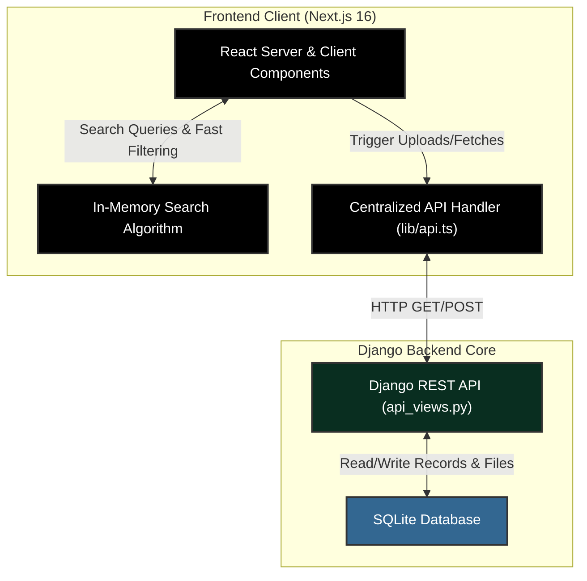

# 🎓 UniShare

UniShare is the ultimate academic vault for students. It provides a lightning-fast, beautifully designed platform to find, organize, share, and download previous year question papers, handwritten notes, and assignments. 

*Note: While UniShare aims to be the "OLX for students," current development is strictly focused on creating the most optimized, organized, and properly filtered file storage vault. Real-time chat and marketplace features will be rolled out in future updates.*

## 📌 Project Status

**Current State:** 
- ✅ Core backend Django REST API is fully operational.
- ✅ Next.js App Router frontend is established with a premium glassmorphic UI.
- ✅ Lightning-fast, in-memory client-side search algorithm implemented.
- ✅ File uploading and rendering logic is complete.
- 🚧 Authentication flows (via Clerk) are temporarily bypassed for rapid UI development.
- 🚧 Real-time chat and OLX-style listings are planned for future phases.

**What all things are to be made (For UI/UX Design):**
- **Single Resource View:** A dedicated page to preview a PDF or note before downloading.
- **User Dashboard Polish:** Better tracking of user statistics (downloads, helpful votes).
- **Authentication Modals:** Clean login/signup UI designs for Clerk integration.

## 📂 File Structure

The project is structured into a decoupled architecture: a Django backend providing a REST API, and a Next.js frontend serving the UI.

```text
unishare/
├── unishare/            # Django project settings and configuration
├── core/                # Main Django application
│   ├── models.py        # Database models (Resource, UserProfile)
│   ├── api_views.py     # DRF ModelViewSets for API endpoints
│   ├── serializers.py   # Data serialization logic
│   └── admin.py         # Django Admin dashboard configuration
├── frontend/            # Next.js 16 frontend application
│   ├── src/
│   │   ├── app/         # Next.js App Router (page.tsx, layout.tsx, upload/, dashboard/)
│   │   ├── components/  # Reusable UI components (Navbar, ResourceCard, ClientSearchAndCatalogue)
│   │   └── lib/         # Utility functions and centralized API handlers (api.ts)
├── venv/                # Python virtual environment
├── db.sqlite3           # Local development database
└── manage.py            # Django management script
```

## 🏗 Architecture & Data Flow



## 🛠 Tech Stack

**Frontend:**
- **Next.js 16** (App Router paradigm)
- **React**
- **Tailwind CSS** (for styling, glassmorphism, micro-animations)
- **Lucide React** (for iconography)
- **shadcn/ui** (for accessible base components)

**Backend:**
- **Django** 
- **Django REST Framework (DRF)**
- **django-filter** (Backend filtering)
- **SQLite** (Development Database - will swap to PostgreSQL for production)

---

## 🚀 How to Run Locally

### Prerequisites
- Python 3.10+
- Node.js 18+

### 1. Backend Setup

1. **Activate the virtual environment:**
   *(The project already has a `venv` created. You just need to activate it.)*
   ```bash
   # On Windows (PowerShell):
   .\venv\Scripts\Activate.ps1
   # On macOS/Linux:
   source venv/bin/activate
   ```

2. **Install Python dependencies:**
   ```bash
   pip install -r requirements.txt
   ```

3. **Run Database Migrations (if pulling fresh):**
   ```bash
   python manage.py makemigrations
   python manage.py migrate
   ```

4. **Start the Django Development Server:**
   ```bash
   python manage.py runserver
   ```
   *The API will be available at `http://localhost:8000/api/`*

### 2. Frontend Setup

1. **Navigate to the frontend directory (in a new terminal):**
   ```bash
   cd frontend
   ```

2. **Install Node modules:**
   ```bash
   npm install
   ```

3. **Start the Next.js Development Server:**
   ```bash
   npm run dev
   ```

The frontend UI will be available at `http://localhost:3000`.
